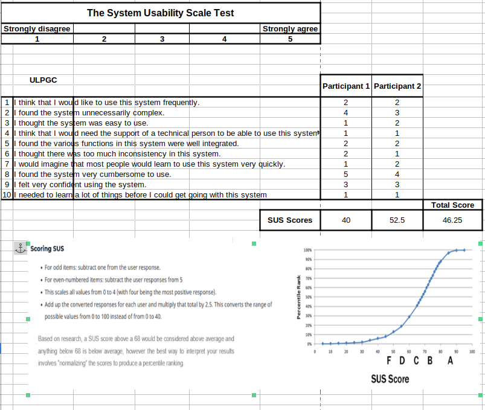
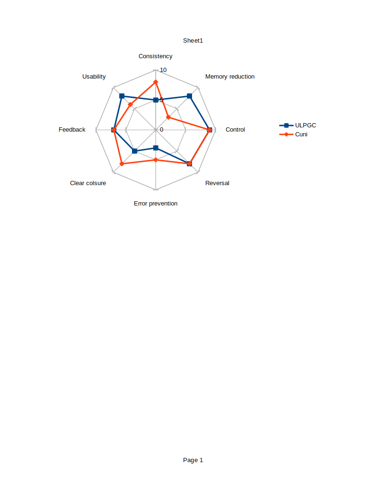

# Usability of university pages

### This is our SUS calculation with explanation for the ULPGC

### Comparison of [ULPGC](ulpgc.es) and CUni [Prague](cuni.cz)
1. Strive for consistency:
At ULPGC every faculty has a very different interface. Also lists of subjects are completely different than the rest of the website.
At CUNI we every faculty has similar design, on the other hand the university information system is different.

2. Seek universal usability: 
ULPGC does this well, because it's team is dedicated to it.
At CUni they shoud work on it. 

3. Offer informative feedback:
ULPGC as well as CUni use hover CSS and validation JS which is enough.

4. Design dialogs to yield closure: 
At ULPGC I didn't always know when the dialog is over.
At CUni it was clear. 

5. Prevent errors:
There are many errors in both pages, the one I remember from ULPGC is that it did not permit me fill in my Czech number because it has different format than the Spanish ones.

6. Permit easy reversal: 
At both universities the forms have reversal.

7. Keep users in control:
Both universities do this well, because their purpose is really just to show information.

8. Reduce short-term memory load
ULPGC is ok at this. 
CUni not so much, you need to know where to find certain pages and they don't have helpful names.

